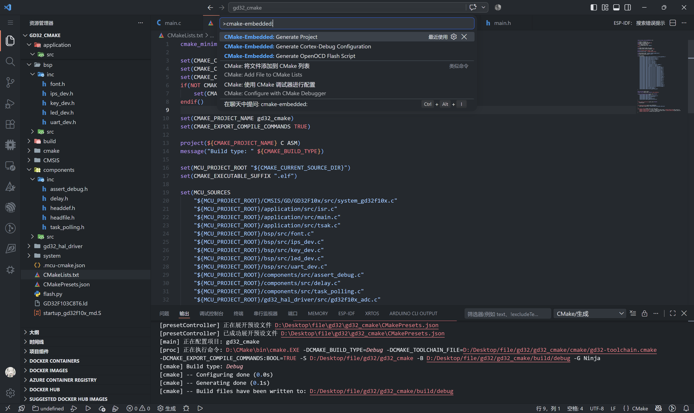

[English](README.md) | [中文](README.zh-CN.md)

# CMake-Embedded

Generate a ready-to-build CMake project for bare-metal MCU firmware directly
from VS Code.

The extension scans the opened workspace for C/C++ sources, headers, and
preprocessor definitions, then generates the CMake files needed for an
`arm-none-eabi-gcc` build.

## Features

- Generate `CMakeLists.txt` from the current project directory
- Generate an MCU linker script and GNU assembler startup file
- Generate the C runtime support files under `system/`
- Generate Debug configure and build presets for Ninja
- Configure CMake Tools to use the generated presets
- Configure C/C++ IntelliSense from the CMake compile database
- Generate an optional OpenOCD `flash.py` script independently from CMake
- Generate a Cortex-Debug OpenOCD launch configuration
- Generate `.elf`, `.hex`, and `.bin` files after a successful build
- Prompt before overwriting generated files

The flash script supports J-Link OB, J-Link, ST-Link, and DapLink. The CMake
device selection and OpenOCD flash-target selection are independent, so a
project can use a custom CMake build and still generate a flash script. The
probe selection provides the OpenOCD interface configuration. GD32 F1/F4
targets use the compatible STM32 F1/F4 OpenOCD targets.

## Demo



The device database currently includes common STM32/GD32 F1 and F4 parts plus
the STM32L4 family,
including `GD32F103C8T6`, `GD32F103CBT6`, `GD32F103R8T6`, `GD32F103RBT6`,
`GD32F407RGT6`, `GD32F407VGT6`, `GD32F450VGT6`, `STM32F103C8T6`,
`STM32F103CBT6`, `STM32F103R8T6`, `STM32F103RBT6`, `STM32F103VBT6`,
`STM32F405RGT6`, `STM32F407RGT6`, `STM32F407VET6`, `STM32F407VGT6`,
`STM32F407ZGT6`, and `STM32L496VET6`.

The device picker groups them by vendor first (`STM` or `GD`), then by series
(`STMF1x`, `STMF4x`, `STML4x`, `GDF1x`, or `GDF4x`).

## Requirements

- VS Code 1.85 or newer
- CMake Tools extension
- C/C++ extension
- Cortex-Debug extension
- CMake 3.22 or newer
- Ninja
- Arm GNU Toolchain with these commands available in `PATH`:
  `arm-none-eabi-gcc`, `arm-none-eabi-g++`, `arm-none-eabi-objcopy`, and
  `arm-none-eabi-size`

## Usage

1. Open the MCU project folder in VS Code.
2. Open the Command Palette and run `CMake-Embedded: Generate Project`.
3. Follow the prompts and confirm the generated files when asked.
4. Configure and build the project with the generated presets:

   ```powershell
   cmake --preset debug
   cmake --build --preset debug
   ```

The project generator asks whether `flash.py` should also be generated. If
selected, it asks for an OpenOCD flash target and probe separately from the
CMake build device. You can also run `CMake-Embedded: Generate OpenOCD Flash
Script` by itself. This command asks only for the flash target and debug probe,
then writes `flash.py` in the project root without changing an existing CMake
project. The flash target database includes STM32 F0/F1/F2/F3/F4/F7/G0/G4/H7/
L0/L1/L4/L5/U5/WB/WL families and GD32 E23x/F1/F4/VF103 targets.

Set `CMake-Embedded: Openocd Path` in VS Code settings when OpenOCD is not available
in `PATH`. The generated script stores that value as its default and accepts
an override when needed:

```powershell
python flash.py
python flash.py --firmware build/my-project.elf
python flash.py --probe stlink
python flash.py --openocd D:\Tools\OpenOCD\bin\openocd.exe
python flash.py --dry-run
```

If Cortex-Debug cannot find the ARM GNU toolchain, set `CMake-Embedded: Arm Toolchain
Path` to the `bin` directory containing the `arm-none-eabi` tools. The generated debug
configuration uses this path and sets the toolchain prefix to `arm-none-eabi`.

Run `CMake-Embedded: Generate Cortex-Debug Configuration` to add a standard
OpenOCD launch configuration to `.vscode/launch.json`. The generated entry
uses `${command:cmake.launchTargetPath}` for the firmware, so it works with
the generated CMake project and with a user-provided CMake project. Existing
launch configurations are preserved. Press `F5` in VS Code to start the
Cortex-Debug session.

After generation, CMake Tools is configured to use CMake presets and configure
the project when the workspace opens. The generated `debug` configure and
build presets are available from CMake Tools. The C/C++ extension reads
include paths, defines, compiler flags, and language settings from the CMake
compile database at `build/debug/compile_commands.json`; the full IntelliSense
engine is enabled with the ARM GCC toolchain so inactive branches of
`#if`/`#ifdef` blocks are dimmed.

The build directory is `build/debug`. Firmware output files are generated
there together with the map file and memory usage report.

## Generated Layout

```text
<project>/
├── CMakeLists.txt
├── CMakePresets.json
├── .vscode/
│   ├── settings.json
│   ├── c_cpp_properties.json
│   └── launch.json             (optional Cortex-Debug configuration)
├── <mcu>.ld
├── startup_<device>.S
├── flash.py                 (optional OpenOCD flash script)
├── cmake/
│   └── <device>-toolchain.cmake
└── system/
    ├── syscalls.c
    └── sysmem.c
```

The generated files are regular project files and can be reviewed or edited
after generation when the project needs custom memory reservations, startup
behavior, or build settings.

## Development

```powershell
npm install
npm test
```

Press `F5` in VS Code to launch an Extension Development Host, open an MCU
workspace, and run `CMake-Embedded: Generate Project` from the Command Palette.

## Project Status

This repository is an early extension prototype. Device profiles and generated
templates are intentionally kept small so more MCU families can be added
incrementally.
